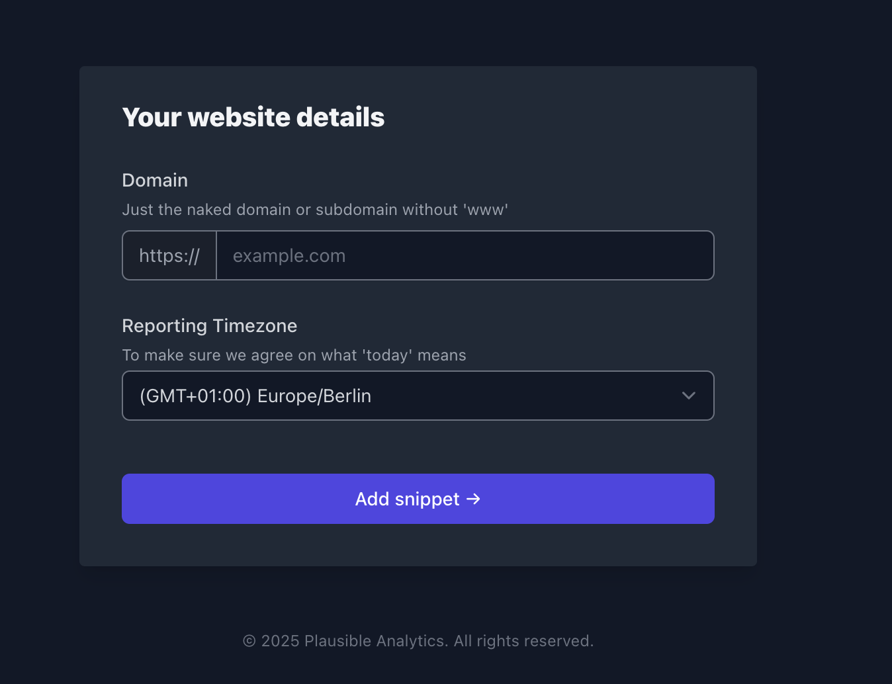

# Introduction

This tutorial describes how to install and run docker on a NetCup VPS and run a Plausible Analytics instance. Plausible Analytics is a  intuitive, lightweight and open source web analytics software. No cookies and fully compliant with GDPR, CCPA and PECR. Plausible is an alternative to Google Analytics and can be selfhosted on your server. Find more information on [https://plausible.io/](https://plausible.io/)

```
First we are going to uninstall any old docker engine and install the latest (can be skipped), then we'll create/edit the docker-compose file, and check all the containers and the setup.
```

# Requirements

- Docker and docker compose or docker-compose
- Linux server (preferrably with Ubuntu installed)
- A domain (optional) for better handling

# Step 1 - Uninstall docker and conflicting packages

Connect to your server via SSH and make sure you have sudo permissions and run:

``` bash
for pkg in docker.io docker-doc docker-compose docker-compose-v2 podman-docker containerd runc; do sudo apt-get remove $pkg; done
```

We're using apt package manager to setup and install docker and its dependend packages:

```bash
sudo apt-get update
sudo apt-get install ca-certificates curl
sudo install -m 0755 -d /etc/apt/keyrings
sudo curl -fsSL <https://download.docker.com/linux/ubuntu/gpg> -o /etc/apt/keyrings/docker.asc
sudo chmod a+r /etc/apt/keyrings/docker.asc

echo \
  "deb [arch=$(dpkg --print-architecture) signed-by=/etc/apt/keyrings/docker.asc] https://download.docker.com/linux/ubuntu \
  $(. /etc/os-release && echo "$VERSION_CODENAME") stable" | \
  sudo tee /etc/apt/sources.list.d/docker.list > /dev/null
sudo apt-get update

sudo apt-get install docker-ce docker-ce-cli containerd.io docker-buildx-plugin docker-compose-plugin

```

These commands install docker and docker compose plugin, which allows to run `docker compose` and do not require extra docker-compose binary to be installed. Alternatively, you can run the following command for using another linux distribution:

``` bash
curl -fsSL https://get.docker.com -o get-docker.sh
sudo sh get-docker.sh
```

# Step 2 - Verify the installation

``` bash
docker --version
```

# Step 3 - Create the working directory for compose and data files

``` bash
mkdir plausible-analytics && cd plausible-analytics
```

# Step 4 - Create the compose file

``` bash
# you can use eitehr nano or vim
mkdir -pv ./plausible/clickhouse
vim docker-compose.yml
```

Paste the content inside this file.

``` yml
---
version: "3.8"
    
services:
  plausible_db:
    # Plausible v2.0.0 was tested against PostgreSQL versions 12, 13, and 14
    # https://github.com/plausible/analytics/blob/v2.0.0/.github/workflows/elixir.yml#L16
    image: postgres:14-alpine
    restart: always
    volumes:
      - plausible_db:/var/lib/postgresql/data
    environment:
      - POSTGRES_PASSWORD=changeme
    networks:
      - overlay
    container_name: plausible-db
    healthcheck:
      test: ["CMD", "pg_isready"]
      interval: 30s
      timeout: 20s
      retries: 3

  plausible_events_db:
    image: clickhouse/clickhouse-server:23.12.6.19-alpine
    restart: always
    volumes:
      - plausible_clickhouse:/var/lib/clickhouse
      - ./plausible/clickhouse/clickhouse-config.xml:/etc/clickhouse-server/config.d/logging.xml:ro
      - ./plausible/clickhouse/clickhouse-user-config.xml:/etc/clickhouse-server/users.d/logging.xml:ro
    ulimits:
      nofile:
        soft: 262144
        hard: 262144
    networks:
      - overlay
    container_name: plausible-events-db

  plausible:
    image: plausible/analytics:v2.0
    restart: always
    command: sh -c "sleep 10 && /entrypoint.sh db createdb && /entrypoint.sh db migrate && /entrypoint.sh run"
    depends_on:
      - plausible_db
      - plausible_events_db
    ports:
      - 8000:8000
    env_file:
      - ./plausible/plausible.env  
    networks:
      - overlay
    container_name: plausible

volumes:
   plausible_db:
      name: 'plausible_db'
   plausible_clickhouse:
      name: 'plausible_clickhouse'

networks:
   overlay:
      driver: bridge
      name: 'overlay'

```

Create the environment file `plausible/plausible.env` with the following content:

```bash
BASE_URL=https://<your-public-ip>
SECRET_KEY_BASE=123456789wqertzuiopasdfghjklyxcvbnm
POSTGRES_PASSWORD=postgres
```

The `plausible.env` file can be mounted as a file in your compose app with the `env_file:` yaml directive. This enhances security as the .env file contains content that is not directly visible in the `docker-compose.yml` file, such as passwords. Edit the file according to your needs and your environment. Change passwords and ports if necessary.

# Step 5 - Spin up the compose stack

With docker compose plugin you can run the following command to create containers:

``` bash
docker compose up -d
```

# Step 6 - Check containers and Plausible

After the compose command created the containers successfully, you can check with `docker ps` if your containers are up.

If you navigate to <https://your-public-ip:8000> of your server, you should see the application running. If you cannot reach the URL after a few minutes, you should check your ufw/ufw-docker to expose the ports through the firewall or check your proxy manager, if you use one.

Now you can proceed with integrating your application with Plausible Analytics by logging in into your instance


and click on `Add a website` button to create a new site. Specify the site name and url here and proceed with Plausible instructions.



# Step 7 - Setup DNS

For better handling, you can set up DNS and a domain to point to your server to avoid hardcoding your public ip address. Go to the customercontrolpanel and head over to domains. Click on your domain and go to DNS. A a new record of type `A` with destination to your servers public ip and save changes. Note that DNS takes a while to be propagated across the globe. Change the url with your domain in your plausible instance.

# Conclusion

Now your self-hosted analytics instance is ready. In the next steps you can set up a domain to host your instance and set up TLS for security and GDPR compliance.

# License

[MIT](https://github.com/netcup-community/community-tutorials/blob/main/LICENSE)

Copyright (c) 2021 netcup

Permission is hereby granted, free of charge, to any person obtaining a copy of this software and associated documentation files (the "Software"), to deal in the Software without restriction, including without limitation the rights to use, copy, modify, merge, publish, distribute, sublicense, and/or sell copies of the Software, and to permit persons to whom the Software is furnished to do so, subject to the following conditions:

The above copyright notice and this permission notice shall be included in all copies or substantial portions of the Software.

THE SOFTWARE IS PROVIDED "AS IS", WITHOUT WARRANTY OF ANY KIND, EXPRESS OR IMPLIED, INCLUDING BUT NOT LIMITED TO THE WARRANTIES OF MERCHANTABILITY, FITNESS FOR A PARTICULAR PURPOSE AND NONINFRINGEMENT. IN NO EVENT SHALL THE AUTHORS OR COPYRIGHT HOLDERS BE LIABLE FOR ANY CLAIM, DAMAGES OR OTHER LIABILITY, WHETHER IN AN ACTION OF CONTRACT, TORT OR OTHERWISE, ARISING FROM, OUT OF OR IN CONNECTION WITH THE SOFTWARE OR THE USE OR OTHER DEALINGS IN THE SOFTWARE.

# Contributor's Certificate of Origin

By making a contribution to this project, I certify that:

 1) The contribution was created in whole or in part by me and I have the right to submit it under the license indicated in the file; or

 2) The contribution is based upon previous work that, to the best of my knowledge, is covered under an appropriate license and I have the right under that license to submit that work with modifications, whether created in whole or in part by me, under the same license (unless I am permitted to submit under a different license), as indicated in the file; or

 3) The contribution was provided directly to me by some other person who certified (a), (b) or (c) and I have not modified it.

 4) I understand and agree that this project and the contribution are public and that a record of the contribution (including all personal information I submit with it, including my sign-off) is maintained indefinitely and may be redistributed consistent with this project or the license(s) involved.
